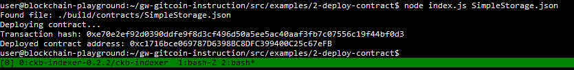

# Gitcoin Nervos Hackathon - Deploy A Simple Ethereum Smart Contract On Polyjuice

## Task Submission

### A screenshot of the console output immediately after you have successfully deployed a smart contract

### The transaction hash from the contract deployment (in text format)
0xe70e2ef92d0390ddfe9f8d3cf496d50a5ee5ac40aaf3fb7c07556c19f44bf0d3

### The deployed contract address from the contract deployment (in text format)
0xc1716bce069787D6398BC8DFC399400C25c67eFB
